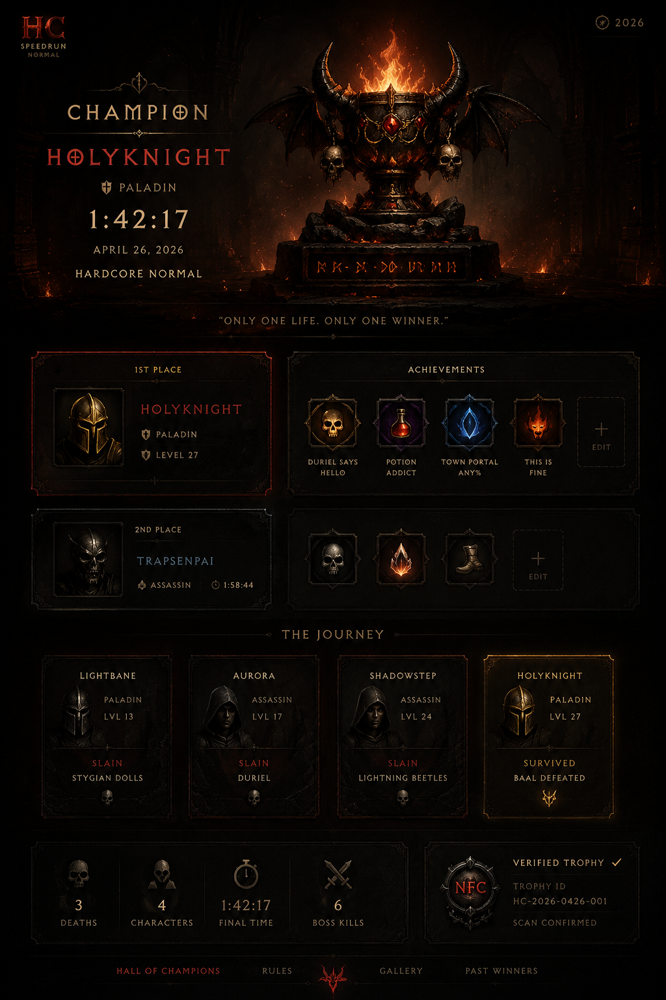

# D2HC

A compact Diablo-inspired one-page tribute for a Hardcore speedrun winner.

Built as a fully static site, the project presents the champion as a dark fantasy artifact screen rather than a typical leaderboard or landing page.

## Highlights

- Pure `HTML`, `CSS`, and `JavaScript`
- Atmospheric visual effects: embers, glow, parallax, fade-in
- Mobile-friendly layout

## Main files

- `index.html` — page structure and content
- `assets/css/styles.css` — visual system, layout, effects, responsiveness
- `assets/js/scripts.js` — embers, parallax, scroll interactions

